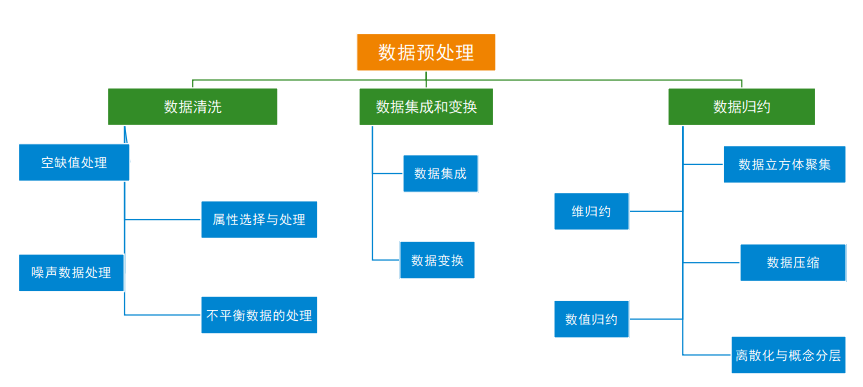
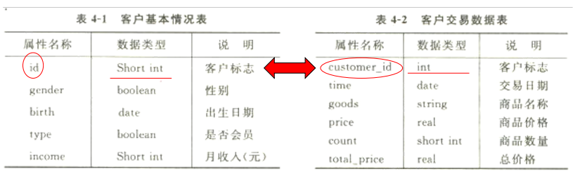

# 大数据分析

# Python语法

# 数据可视化

## Matplotlib

### 安装与调用

▪**安装**

pip install matplotlib

▪**调用**

最常用：

import matplotlib

from matplotlib import pyplot as plt

▪**注意**：

Matplotlib有两种绘图方式，一种是使用类似于MATLAB的函数接口API（可以简单理解为使用plt.function())，另一种是使用面向对象的API（例如ax.function()，其中ax是matplotlib的一个实例对象)。第一种上手容易，第二种功能更为强大，逻辑更为清晰。本课程主要是用第一种。

API（Application Programming Interface，应用程序接口）

## Seaborn

▪**Seaborn**是一种基于matplotlib的图形可视化python library，是在matplotlib的基础上进行了**更高级的**API **封装**。它提供了一种**高度交互式界面**，便于用户能够做出各种有吸引力的**统计图表**。

### 特点

- 基于matplotlib美学的绘图风格，增加了绘图模式
- 增加调色板功能，利用色彩丰富的图像揭示数据中的模式
- 能运用数据子集绘制与比较单变量和双变量分布
- 能运用聚类算法可视化矩阵数据
- 可灵活运用处理时间序列数据
- 能利用网格建立复杂图像集

### Seaborn基础语法

- 五种主题风格

  - darkgrid（灰色网格）
  - whitegrid（白色网格）
  - dark（黑色）
  - white（白色）
  - ticks（十字叉）

- 统计分析制图--可视化统计关系

  统计分析是了解数据集中的变量如何相互关联以及这些关系如何依赖于其他变量的过程。常见方法可视化统计关系：**散点图和线图**。

  - **常用的函数**

  - •relplot()——散点图

    •distplot ()——直方图

    •jointplot()——单标量或多变量图

    •regplot()——回归分析图

    •boxenplot()——箱型图

    •stripplot ()/Catplot()——分类属性绘图

    •heatmap()——热力图

    •clustermap()——集群图

    •pairplot()——对比图

  - 常用的参数

  - •x,y,hue:数据集变量 变量名 

    •date:数据集 数据集名 

    •row,col:更多分类变量进行平铺显示 变量名 

    •col_wrap :每行的最高平铺数 整数 

    •estimator:在每个分类中进行矢量到标量的映射 矢量 

    •ci :置信区间 浮点数或None

    •n_boot :计算置信区间时使用的引导迭代次数 整数 

    •units:采样单元的标识符，用于执行多级引导和重复测量设计 数据变量或向量数据 

    •order, hue_order :对应排序列表 字符串列表 

    •row_order, col_order:对应排序列表 字符串列表 

    •kind : 可选：point 默认, bar 柱形图, count 频次, box 箱体, violin 提琴, strip 散点，swarm 分散点

    •size 每个面的高度（英寸） 标量 

    •aspect 纵横比 标量 

    •orient 方向 "v"/"h" 

    •color 颜色 matplotlib颜色 

    •palette 调色板 seaborn颜色色板或字典 legend 

### Seaborn绘制散点图

### Seaborn绘制直方统计图

### Seaborn绘制双变量关系图

### Seaborn绘制回归分析图

### Seaborn绘制树状图

### Seaborn绘制箱型图

boxplot

boxenplot 绘制的更多

### 分类属性绘图

与箱型图配合

### 热力图

### 集群图（聚类后的热力图）

### 对比图

## 学术制图规范

### SCI期刊制图展示

### SCI期刊制图相关注意事项

#### 配色要求

#### 图片大小要求

#### 图片分辨率要求

#### 文件命名要求

#### 其他注意事项

# 数据预处理

## 课程pdf

## 引入
- 原始业务数据（或数据仓库）是数据挖掘的信息来源，但往往存在以下问题：
	- 不完整
	- 有噪声
	- 不一致
	- 重复
	- 纬度高
	- 不平衡
- 数据预处理根据用户需求，确定挖掘任务，采用合适的方法重新组织原
始数据，为数据挖掘过程提供干净、准确、简洁的数据，提高数据挖掘
的效率与准确性！

## 数据预处理方法

### 数据清洗

#### 空缺值处理

- 忽略该记录
- 去掉该属性
- 写空缺值
  - 根据背景资料，手工填写
- 使用默认值
  - Unknown
  - 挖掘算法可能认为形成了一个有用的知识
- 使用属性平均值
- 使用同类样本平均值
- 预测最可能的值
  - 从现有数据的多个信息推测空缺值
  - 根据其他完整的记录数据，使用一定的预测方法，的到最可能的预测值
  - 一些数据挖掘算法在处理空值方面的能力比较强，如决策树算法、关联规则算法等，能够快速产生较为准确的知识模型！

#### 属性选择与处理

- 从原始数据中选取和使得属性进行数据挖掘

- 选取原则

  

#### 噪声数据处理

#### 不平衡数据处理

### 数据集成

- 把多个数据存储合并起来
- 涉及数据的冲突问题和不一致数据的处理问题
  - 模式匹配
  - 数据冗余
  - 数据值冲突

**案例分析：**

#### 模式匹配

本质信息相同的数据：如上两个客户标志

#### 数据冗余

- 重复：多个相同的记录
- 冗余属性：一个属性可以由其他属性推导得出
- 相关分析法：如Pearson相关系数、秩相关等
- 案例分析：如下商品价格、商品数量、总价格，可以互相推导。

#### 数据值冲突

- 在多个数据源中，表示同一实体的属性值可能不同
- 如单位为元、千元；类型为0/1、Y/N等

### 数据变换

#### 平滑

#### 聚集

#### 数据概化

#### 规范化(标准化)

- 将数据按比例缩放，使之落入一个特定的区域，如[0，1]，称为规范化/标准化
- 规范化对基于距离的聚类算法和神经网络算法是非常重要的
- 可以保证输入值在一个相对小的范围内
- 常用方法
  - 最小-最大规范化（min-max）
  - 零-均值规范化（Z-score）
  - 小数定标规范化

##### 最小-最大规范化

$$
x^{\prime}=\frac{x - old_{min} }{old_{max}-old_{min} }\left(new_{-} \max-new_\min \right)+new_{min}
$$

- 区间映射，前提条件是属性的取值范围必须已知

##### 零-均值规范化（Z-score）

##### 小数定标规范化

- 通过移动属性值的小数点位置进行规范化
- 需要在属性取值范围已知的条件下使用
- 小数点移动的位数根据属性的最大绝对值确定

### 数据规约

#### 
