# 大数据分析

# Python语法

# 数据可视化

## Matplotlib

### 安装与调用

▪**安装**

pip install matplotlib

▪**调用**

最常用：

import matplotlib

from matplotlib import pyplot as plt

▪**注意**：

Matplotlib有两种绘图方式，一种是使用类似于MATLAB的函数接口API（可以简单理解为使用plt.function())，另一种是使用面向对象的API（例如ax.function()，其中ax是matplotlib的一个实例对象)。第一种上手容易，第二种功能更为强大，逻辑更为清晰。本课程主要是用第一种。

API（Application Programming Interface，应用程序接口）

## Seaborn

▪**Seaborn**是一种基于matplotlib的图形可视化python library，是在matplotlib的基础上进行了**更高级的**API **封装**。它提供了一种**高度交互式界面**，便于用户能够做出各种有吸引力的**统计图表**。

### 特点

- 基于matplotlib美学的绘图风格，增加了绘图模式
- 增加调色板功能，利用色彩丰富的图像揭示数据中的模式
- 能运用数据子集绘制与比较单变量和双变量分布
- 能运用聚类算法可视化矩阵数据
- 可灵活运用处理时间序列数据
- 能利用网格建立复杂图像集

### Seaborn基础语法

- 五种主题风格

  - darkgrid（灰色网格）
  - whitegrid（白色网格）
  - dark（黑色）
  - white（白色）
  - ticks（十字叉）

- 统计分析制图--可视化统计关系

  统计分析是了解数据集中的变量如何相互关联以及这些关系如何依赖于其他变量的过程。常见方法可视化统计关系：**散点图和线图**。

  - **常用的函数**

  - •relplot()——散点图

    •distplot ()——直方图

    •jointplot()——单标量或多变量图

    •regplot()——回归分析图

    •boxenplot()——箱型图

    •stripplot ()/Catplot()——分类属性绘图

    •heatmap()——热力图

    •clustermap()——集群图

    •pairplot()——对比图

  - 常用的参数

  - •x,y,hue:数据集变量 变量名 

    •date:数据集 数据集名 

    •row,col:更多分类变量进行平铺显示 变量名 

    •col_wrap :每行的最高平铺数 整数 

    •estimator:在每个分类中进行矢量到标量的映射 矢量 

    •ci :置信区间 浮点数或None

    •n_boot :计算置信区间时使用的引导迭代次数 整数 

    •units:采样单元的标识符，用于执行多级引导和重复测量设计 数据变量或向量数据 

    •order, hue_order :对应排序列表 字符串列表 

    •row_order, col_order:对应排序列表 字符串列表 

    •kind : 可选：point 默认, bar 柱形图, count 频次, box 箱体, violin 提琴, strip 散点，swarm 分散点

    •size 每个面的高度（英寸） 标量 

    •aspect 纵横比 标量 

    •orient 方向 "v"/"h" 

    •color 颜色 matplotlib颜色 

    •palette 调色板 seaborn颜色色板或字典 legend 

### Seaborn绘制散点图

### Seaborn绘制直方统计图

### Seaborn绘制双变量关系图

### Seaborn绘制回归分析图

### Seaborn绘制树状图

### Seaborn绘制箱型图

boxplot

boxenplot 绘制的更多

### 分类属性绘图

与箱型图配合

### 热力图

### 集群图（聚类后的热力图）

### 对比图

## 学术制图规范

### SCI期刊制图展示

### SCI期刊制图相关注意事项

#### 配色要求

#### 图片大小要求

#### 图片分辨率要求

#### 文件命名要求

#### 其他注意事项

# 数据预处理

## 课程pdf

## 引入
- 原始业务数据（或数据仓库）是数据挖掘的信息来源，但往往存在以下问题：
	- 不完整
	- 有噪声
	- 不一致
	- 重复
	- 纬度高
	- 不平衡
- 数据预处理根据用户需求，确定挖掘任务，采用合适的方法重新组织原
始数据，为数据挖掘过程提供干净、准确、简洁的数据，提高数据挖掘
的效率与准确性！

## 数据预处理方法

### 数据清洗

#### 空缺值处理

- 忽略该记录
- 去掉该属性
- 写空缺值
  - 根据背景资料，手工填写
- 使用默认值
  - Unknown
  - 挖掘算法可能认为形成了一个有用的知识
- 使用属性平均值
- 使用同类样本平均值
- 预测最可能的值
  - 从现有数据的多个信息推测空缺值
  - 根据其他完整的记录数据，使用一定的预测方法，的到最可能的预测值
  - 一些数据挖掘算法在处理空值方面的能力比较强，如决策树算法、关联规则算法等，能够快速产生较为准确的知识模型！

#### 属性选择与处理

- 从原始数据中选取和使得属性进行数据挖掘

- 选取原则

  

#### 噪声数据处理

#### 不平衡数据处理

### 数据集成

- 把多个数据存储合并起来
- 涉及数据的冲突问题和不一致数据的处理问题
  - 模式匹配
  - 数据冗余
  - 数据值冲突

**案例分析：**

#### 模式匹配

本质信息相同的数据：如上两个客户标志

#### 数据冗余

- 重复：多个相同的记录
- 冗余属性：一个属性可以由其他属性推导得出
- 相关分析法：如Pearson相关系数、秩相关等
- 案例分析：如下商品价格、商品数量、总价格，可以互相推导。

#### 数据值冲突

- 在多个数据源中，表示同一实体的属性值可能不同
- 如单位为元、千元；类型为0/1、Y/N等

### 数据变换

#### 平滑

#### 聚集

#### 数据概化

#### 规范化(标准化)

- 将数据按比例缩放，使之落入一个特定的区域，如[0，1]，称为规范化/标准化
- 规范化对基于距离的聚类算法和神经网络算法是非常重要的
- 可以保证输入值在一个相对小的范围内
- 常用方法
  - 最小-最大规范化（min-max）
  - 零-均值规范化（Z-score）
  - 小数定标规范化

##### 最小-最大规范化

$$
x^{\prime}=\frac{x - old_{min} }{old_{max}-old_{min} }\left(new_{-} \max-new_\min \right)+new_{min}
$$

- 区间映射，前提条件是属性的取值范围必须已知

##### 零-均值规范化（Z-score）

##### 小数定标规范化

- 通过移动属性值的小数点位置进行规范化
- 需要在属性取值范围已知的条件下使用
- 小数点移动的位数根据属性的最大绝对值确定

### 数据规约

# 模型的评估与选择

- 如何获得测试结果 =》 评估方法
- 如何评估性能优劣 =》性能度量
- 如何判断实质区别 =》 比较检验

## 数据建模分析步骤

1. 数据选择：将你的数据分成三组：训练数据、验证数据和测试数据（训练效果，验证效果，泛化效果)。
2. 数据建模：使用训练数据来构建使用相关特征的模型（特征：对分类或者回归结果有影响的数据属性）。
3. 模型训练：使用训练数据训练模型。使用验证数据接入算法模型，来确定算法模型的类型、参数等。
4. 模型测试：使用测试数据检查被训练并验证的模型的表现（模型的评价标准：准确率、精确率、召回率等)
5. 模型使用:使用完全训练好的模型在新数据上做预测。
6. 模型调优：使用更多数据、不同的特征或调整过的参数来提升算法的性能表现。

## 经验误差与过拟合

- **经验误差**： 在训练集上的误差，亦称为“训练误差”

- **泛化误差**：在“未来”样本上的误差，即预测时出现的误差。

  

- 泛化误差越小越好

- 经验误差是否越小越好

  - 否！因为很可能过拟合

### 过拟合(over fitting)与欠拟合(underfitting)

## 偏差与方差

“偏差-方差分解”是解释数据分析模型性能的一种重要工具，回答了误差”从何而来这个问题。

| 符号         | 涵义                                             |
| ------------ | ------------------------------------------------ |
| 𝑥            | 测试样本                                         |
| 𝐷            | 数据集                                           |
| $y_D$        | 𝑥在数据集中的标记（样本 值）                     |
| $𝑦$          | 𝑥的真实标记（真实值）                            |
| 𝑓            | 数据集𝐷学得的模型                                |
| 𝑓(𝑥; 𝐷)      | 由数据集𝐷学得的模型𝑓对 𝑥的预测输出（模型输出值） |
| $\bar{f}(x)$ | 模型𝑓对𝑥的期望预测输出                           |

### 噪声

由于样本值与真实值的差别而产生，属于数据本身的误差，与模型无关。  
$$
\varepsilon^2=E_D\left[\left(y_D-y\right)^2\right]
$$

### 偏差

期望输出与真实值的差别  
$$
\operatorname{bias}^2(x)=(\bar{f}(x)-y)^2
$$

### 方差

使用样本数相同的不同训练集得到的模型方差。  
$$
\operatorname{var}(x)=E_D\left[(f(x ; D)-\bar{f}(x))^2\right]
$$

### 算法的期望误差

算法期望的误差：
$$
E(f ; D)=E_D\left[\left(f(x ; D)-y_D\right)^2\right]
$$
数学化简得
$$
E(f ; D)=E_D\left[(f(x ; D)-\bar{f}(x))^2\right]
+(\bar{f}(x)-y)^2+E_D\left[\left(y_D-y\right)^2\right]
$$

$$
泛化误差=方差var+偏差bias^2+噪声\epsilon^2
$$

### Summary

**偏差：**度量了模型的期望预测和真实值的偏离程度，刻画了模型本身的拟合能力。

**方差：**度量了同样大小的训练集的变动所导致的学习性能的变化，即刻画了数据
扰动所造成的影响。

**噪声：**数据本身的误差。表达了当前任务上任何模型所能达到的期望泛化误差的
下界，刻画了学习问题本身的难度  

泛化性能是由模型的能力、数据的充分性以及学习任务本身的难度所共同决定的。
给定学习任务，为了取得好的泛化性能，则需使偏差较小，即能够充分拟合数据，
并且使方差较小，即使得数据扰动产生的影响小。但是偏差和方差在一定程度上
是有冲突的，这称作为**偏差-方差窘境(bias-variance dilemma)。**  

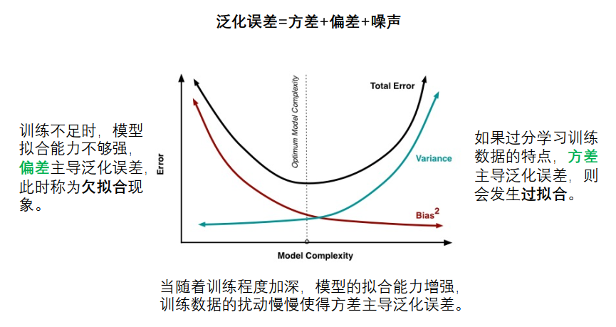

## 评估方法

现实任务中往往会对模型的泛化性能、时间开销、存储开销、可解释性等方面的因素进行评估并做出选择。  

我们假设测试集是从样本真实分布中独立采样获得，将测试集上的“测试误差”作为泛
化误差的近似，所以测试集要和训练集中的样本尽量互斥，即：将原始数据集D，划分成训
练集S与测试集T时，S/T两者要尽可能互斥  

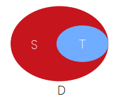

**关键问题：如何获得“测试集”(test set)**

- 留出法（hold-out）
- 交叉验证法（cross validation）
- 自助法（bootstrap）  

### 留出法

- 直接将数据集划分为两个互斥集合
-  训练/测试集划分要尽可能保持数据分布的一致性（如：分层采样）
-  训练/测试样本比例通常为2：1~4：1，不能太小也不能太大。  

### K-折交叉验证法

将数据集分层采样划分为k个大小相似的互斥子集，每次用k-1个子集的并集作为训练集，余下的子集作为测试集，最终返回k个测试结果的均值，k最常用的取值是10.  

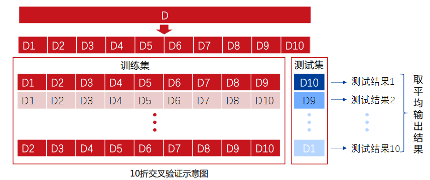

### 自助法

以自助采样法（bootsrap sampling）为基础，对包含m个样本的数据集D有放回采样m次得到训练集D’，D\D’用做测试集（约1/3），即“有放回采样”、“可重复采样”。

- 实际模型与预期模型都使用m个训练样本（同规模）
- 自助法在数据集较小、难以有效划分训练/测试集时很有用
- 从初始数据集中产生多个不同的训练集，对**集成学习**有很大的好处
- 由于改变了数据集分布可能引入估计偏差，**在数据量足够时，留出法和交叉验证法更常用。**  

### “调参”与最终模型

- 算法的参数：一般由人工设定，亦称“超参数”
- 模型的参数：一般由学习确定

- 调参过程相似：先产生若干模型，然后基于某种评估方法进行选择。

  -  给定一系列参数的备选值，对于每一个备选值，用“训练集”训练模
    型，用“验证集”评估模型效果，

  -  选择模型效果最好的参数备选值作为最终参数值

    **参数调得好不好往往对最终性能有关键影响**  

- 算法参数选定后，要用“训练集”重新训练最终模型，用“测试集”评估模型效果  

- 区别：训练集 VS 测试集 VS 验证集（validation set）  

## 性能度量

性能度量（performance measure）是衡量模型泛化能力的评价标准，反映了任务需求，使用不同的性能度量往往会导致不同的评判结果  

什么样的模型是“好”的，不仅取决于算法和数据，还取决于**任务需求**  

- 在**预测任务中**，给定样例集 $D=\left\{\left(\mathbf{x}_1, y_1\right),\left(\mathbf{x}_2, y_2\right), \ldots,\left(\mathbf{x}_m, y_m\right)\right\}$评估模型的性能 f 也即把预测结果f (x)和真实标记比较  

- 对于**回归任务**最常用的性能度量“均方误差”：$E(f ; D)=\frac{1}{m} \sum_{i=1}^m\left(f\left(\mathbf{x}_i\right)-y_i\right)^2$

- 对于**分类任务**，错误率和精度是最常用的两种性能度量：

  - 错误率：分错样本占样本总数的比例$E(f ; D)=\frac{1}{m} \sum_{i=1}^m \Pi\left(f\left(\mathbf{x}_i\right) \neq y_i\right)$

  - 精度：分对样本占样本总数的比率$\operatorname{acc}(f ; D)=\frac{1}{m} \sum_{i=1}^m \Pi\left(f\left(\mathbf{x}_i\right)=y_i\right)=1-E(f ; D)$
  - 查准率
  - 查全率/召回率

### 查准率(Precision)与查全率/召回率(Recall)

信息检索、Web搜索等场景中经常需要衡量预测出来的正例中正确的比率或正例被预测出来的比率，此时查准率和查全率/召回率比错误率和精度更适合。

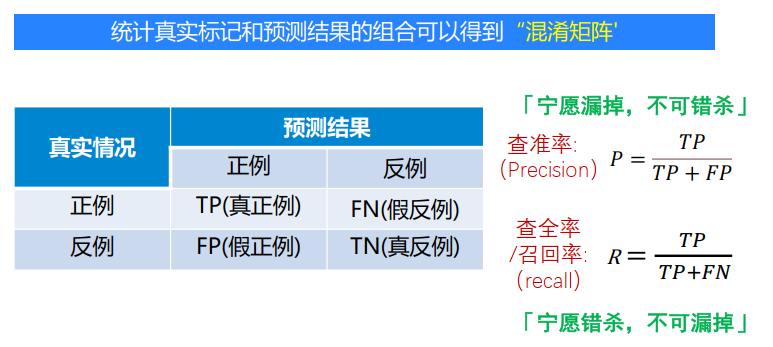

### **平衡点与P-R曲线**

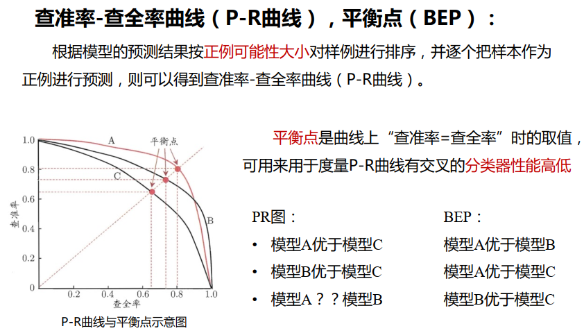

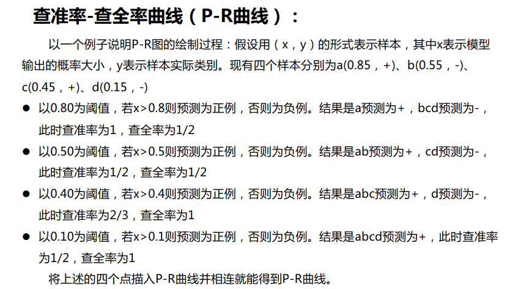

### $\bf{F_1}$度量与$\bf{F_\beta}$

- 比P-R曲线平衡点更常用的时$F_1$度量：$F_1=2 \cdot \frac{\text { precision } \cdot \text { recall }}{\text { precision }+\text { recall }}$

- 比$F_1$更一般的形式$F_{\beta}$：$F_\beta=\left(1+\beta^2\right) \frac{\text { precision } \cdot \text { recall }}{\left(\beta^2 \cdot \text { precision }\right)+\text { recall }}$
  - 𝛽 =1 ：标准F1
  - 𝛽>1：偏重查全率（recall）一些（逃犯信息检索）
  - 𝛽 < 1：偏重查准率（precision）一些（商品推荐系统）  

### ROC与AUC

ROC全称是“受试者工作特征”(Receiver Operating Characteristic)曲线，其纵轴是
“真正例率”(True Positive Rate, 简称TPR)，**横轴**是“假正例率”(False Positive Rate,简
称FPR），对角线对应着“随机猜想”模型，将真正例率和假正例率以图示方法结合在一起，可**准确反映某种模型真正例率和假正例率的关系**，是检测准确性的综合代表 。

真正例率（查全率）: $TPR = \frac{TP}{TP+FN}$

假正例率: $FPR=\frac{FP}{TN+FP}$

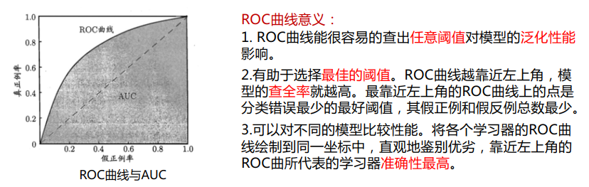

如果两条ROC曲线没有相交，我们可以根据哪条曲线最靠近左上角哪条曲线代表的模型
性能就最好。如果两条ROC曲线发生了交叉，则很难一般性地断言谁优谁劣。
	**AUC：**根据ROC曲线下面积大小进行比较，也即AUC值。  

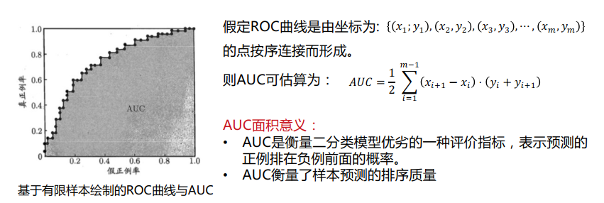

### 代价敏感错误率与代价曲线

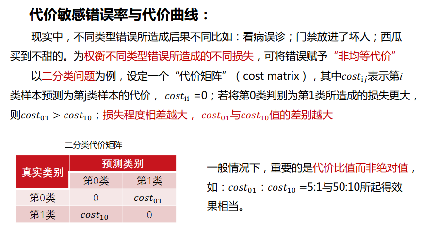

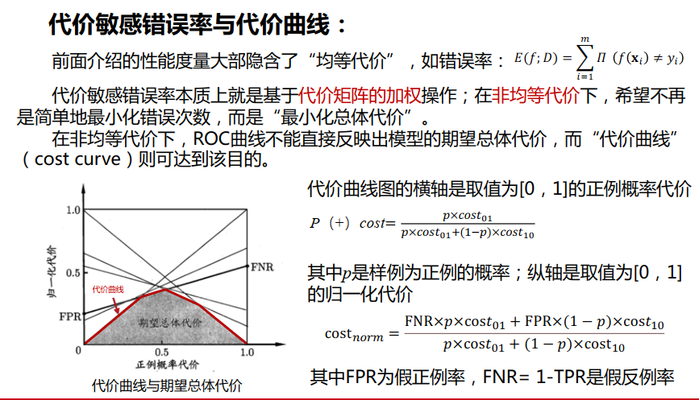

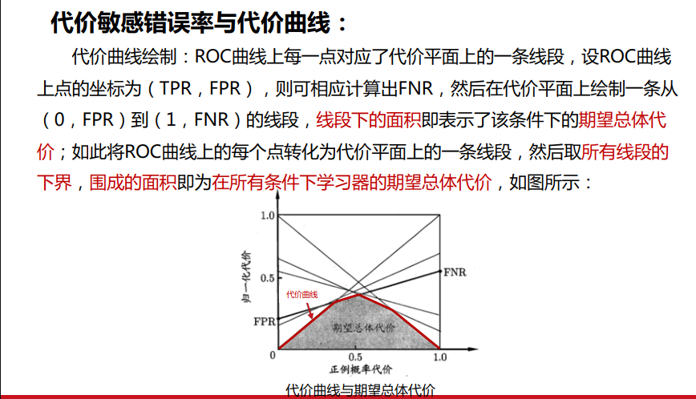

### Summary

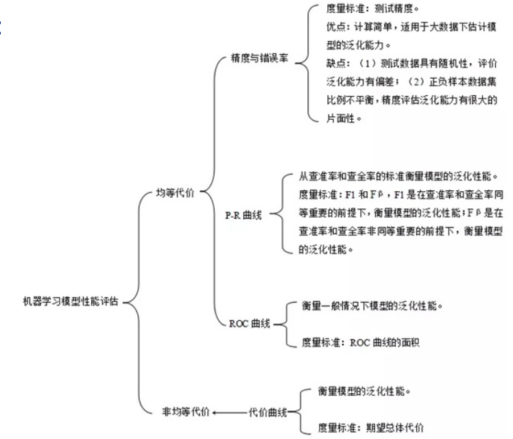

## 比较检验

- 一种方式，通过性能度量的指标对比模型的好坏
- 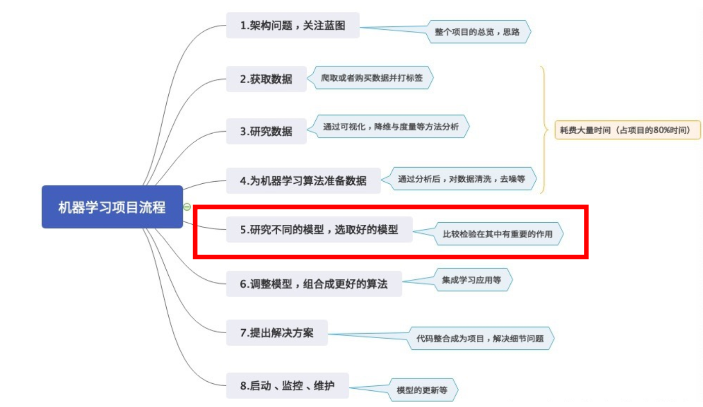

- 统计假设检验(hypothesis test)为模型性能比较提供了重要依据。
  基于假设检验结果我们可推断出，若在测试集上观察到模型A比B好，则A的泛化性能是否在统计意义上优于B，以及这个结论的把握有多大  

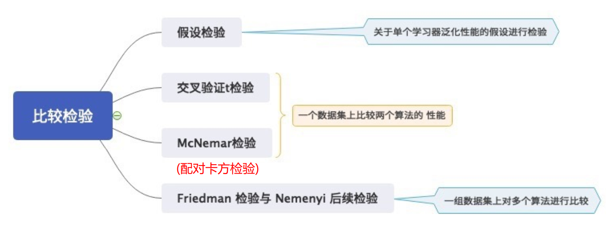
