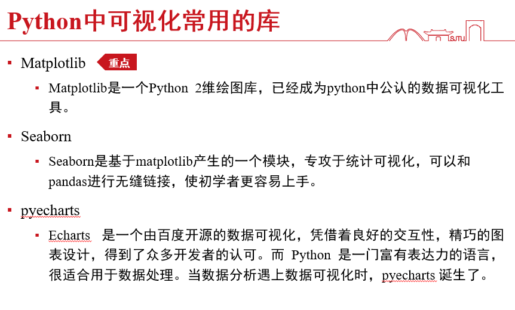

# 数据可视化

## Matplotlib

### 安装与调用

▪**安装**

pip install matplotlib

▪**调用**

最常用：

import matplotlib

from matplotlib import pyplot as plt

▪**注意**：

Matplotlib有两种绘图方式，一种是使用类似于MATLAB的函数接口API（可以简单理解为使用plt.function())，另一种是使用面向对象的API（例如ax.function()，其中ax是matplotlib的一个实例对象)。第一种上手容易，第二种功能更为强大，逻辑更为清晰。本课程主要是用第一种。

API（Application Programming Interface，应用程序接口）

## Seaborn

▪**Seaborn**是一种基于matplotlib的图形可视化python library，是在matplotlib的基础上进行了**更高级的**API **封装**。它提供了一种**高度交互式界面**，便于用户能够做出各种有吸引力的**统计图表**。

### 特点

- 基于matplotlib美学的绘图风格，增加了绘图模式
- 增加调色板功能，利用色彩丰富的图像揭示数据中的模式
- 能运用数据子集绘制与比较单变量和双变量分布
- 能运用聚类算法可视化矩阵数据
- 可灵活运用处理时间序列数据
- 能利用网格建立复杂图像集

### Seaborn基础语法

- 五种主题风格

  - darkgrid（灰色网格）
  - whitegrid（白色网格）
  - dark（黑色）
  - white（白色）
  - ticks（十字叉）

- 统计分析制图--可视化统计关系

  统计分析是了解数据集中的变量如何相互关联以及这些关系如何依赖于其他变量的过程。常见方法可视化统计关系：**散点图和线图**。

  - **常用的函数**

  - •relplot()——散点图

    •distplot ()——直方图

    •jointplot()——单标量或多变量图

    •regplot()——回归分析图

    •boxenplot()——箱型图

    •stripplot ()/Catplot()——分类属性绘图

    •heatmap()——热力图

    •clustermap()——集群图

    •pairplot()——对比图

  - 常用的参数

  - •x,y,hue:数据集变量 变量名 

    •date:数据集 数据集名 

    •row,col:更多分类变量进行平铺显示 变量名 

    •col_wrap :每行的最高平铺数 整数 

    •estimator:在每个分类中进行矢量到标量的映射 矢量 

    •ci :置信区间 浮点数或None

    •n_boot :计算置信区间时使用的引导迭代次数 整数 

    •units:采样单元的标识符，用于执行多级引导和重复测量设计 数据变量或向量数据 

    •order, hue_order :对应排序列表 字符串列表 

    •row_order, col_order:对应排序列表 字符串列表 

    •kind : 可选：point 默认, bar 柱形图, count 频次, box 箱体, violin 提琴, strip 散点，swarm 分散点

    •size 每个面的高度（英寸） 标量 

    •aspect 纵横比 标量 

    •orient 方向 "v"/"h" 

    •color 颜色 matplotlib颜色 

    •palette 调色板 seaborn颜色色板或字典 legend 

### Seaborn绘制散点图

### Seaborn绘制直方统计图

### Seaborn绘制双变量关系图

### Seaborn绘制回归分析图

### Seaborn绘制树状图

### Seaborn绘制箱型图

boxplot

boxenplot 绘制的更多

### 分类属性绘图

与箱型图配合

### 热力图

### 集群图（聚类后的热力图）

### 对比图

## 学术制图规范

### SCI期刊制图展示

### SCI期刊制图相关注意事项

#### 配色要求

#### 图片大小要求

#### 图片分辨率要求

#### 文件命名要求

#### 其他注意事项

