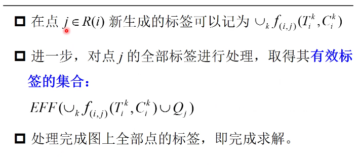
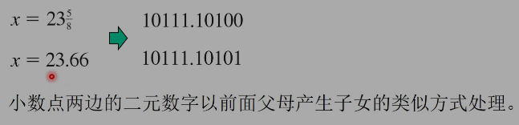

# 优化算法设计


# 绪论（计算复杂性）

NPC NP P NPH

P=NP?

P!=NP?

# 第二章-启发式方法

## 引言

### 为什么启发式

- 大量的NP难、NP完全问题是几乎不存在多项式时间的精确算法，必须找合适的方法；
- 很多不具备多项式计算时间的精确算法，可以求解小规模的实例，但是当问题实例规模扩大，显然求解时间是无法接受的；
- 启发式方法，不追求一定是最优解（optimal），而是希望获得非常高质量的可行解（feasible），当然在部分情况下也可能就是得到了最优解。

## 概念-（局部和全局最优）

- 搜索算法系统地尝试不同决策变量的取值，直到找到一个足够好的结果时停止搜索。
- **解**：解是一组决策变量的取值。搜索中尝试过的一系列点称为“解”。
- **邻域(neighborhood)**: 解的邻域由所有附近的点组成，即所有与解有一段较小距离的点。
- **局部最优**: 倘若一组可行解周围足够小的邻域内不存在优于该解的可行点，则称该解为局部最优解(local optimum)
- 从数学角度出正的最优优解应当是可行的，同时具备不劣于任何其他可行解的目标函数值。<u>如果在全局范围内不存在目标值优于某可行解的其他可行点,则该解为全局最优解(global optimum)</u>。
- 全局最优也是局部最优，局部最优不一定是全局最优
- 搜索算法在到达局部最优时停止，然而局部最优不一
  定是全局最优。
- **原理：搜索算法<u>最为适应的是能够从数学上保证每一个局部最优都是全局最优的优化模型</u>。有时可以确**
  **定模型中局部最优同时也是全局最优。**？？？？
- 对于拥有局部最优但不是全局最优的模型，常见的简单方法是进行若干次独立搜索，将其中最好的局部最优解作为启发式(heuristic)或近似最优(approximate optimum)。

## 搜索算法

- 一些优化模型的最优解能够通过显式表达式明确求解，但绝大多数优化模型却只能通过数值搜索(numerical
  search)的方法来求解，即依次尝试不同的决策变量取值，直到得到一个满意的结果。
- 搜索算法通过检查邻域来寻找比当前好的解：若有，则替换当前解，继续迭代直到邻域中没有更好的解。
- 搜索算法又称局部搜索(search) 、爬山算法(hillclimbing)、邻域搜索(neighborhood search)。


## 【方向-步长】 范式

- 搜索算法沿着：
  $$
  \mathbf{x}^{(t+1)} \leftarrow \mathbf{x}^{(t)}+\lambda \Delta \mathbf{x}
  $$


## 可行方向的搜索


## 确定步长


## 改进方向代数计算


### 例子


1、Ans：是改进的方向

2、Ans：不是改进的方向


## 


## 可行方向和紧约束


## 连续搜索算法


## 一种特例：线性约束


## 线性目标和凸集的易处理性

- 虽然有时候较为复杂的形式是无法避免的，但建模时常常涉及精确性和易处理性之间的权衡。为了获得能够产生有意义启示的易处理模型，有时选择简化假设或采用其他方式简化模型。

- 线性目标函数的易处理性：线性目标函数是决策变量加权和的表达式，一般形式如下：
  $$
  In \space PPT
  $$
  

  - 其中，x是n个决策变量组成的n维度向量；c 是对应的n维度向虽目标承数系数。


### 凸集

- 在凸集中，以上问题，即局部最优指向全局最优但足无法达到可以避免。

- 凸集：如果可行域内任意两点的连线都在可行域内，此可行域为凸集。

  

### 凸集的易处理性


- 原理：如果优化模型的可行集是凸集，那么对任意可行解始终存在指向另一解的可行方向。
- 以上说明：以上条件下，只要存在更优的可行解，可行性不会阻碍局部最优解发展成全局最优解。
- 

- 线性规划解空间一定是凸集，凸集不一定是线性规划解空间

- 由于线性规划（LP）是目标函数和约束条件都具有线性，同时具有连续的决策变量。
- 我们知道：线性约束集的问题可行域是凸集
- ……to 补充


# 第三章-面向离散优化问题构造型启发式和改进搜索

## 启发式的需求

- 大量的NP难、NP完全问题是几乎可以确定不存在多项式时间的精确算法，必须找合适的方法；
- 很多大型离散优化问题，启发式方法简单、切实可行。
  - 回顾：离散优化。优化模型中决策变量如果存在离散变量，优化模型为离散优化（Discrete Optimization）,否则称为连续优化。整数规划就是典型离散优化。

## 启发式的特点

- 启发式方法，不追求一定是最优解（optimal），而是希望获得高质量的可行解。当然，在部分情况下也可能就是得到了最优解。
- 本部分关注严格意义上的启发式方法，不追求和精确算法的相似结构，而是基于问题的本身结构，寻找那些最有机会得到最优解、高质量解的办法。
- 启发式方法可能结果很好，不过一般需要“大量的数据实例的评估”。

## 构造型启发式

- 第一类启发式算法为构造启发式搜索算法，这个方法可以逐步建立一个高质量的解。
- 该算法逐个选择离散决策变量的值，即从部分解开始一次只选择一个决策变量的值，每次迭代中当前决策定的情况下，一个先前自由的变量固定为一个可行值，直到得到一个完整的可行解。

### 基础构造型的启发式方法

- 第0步：初始化。从初始解x(0)开始，其全部变量都是待
  定自由的。设定1 =0。
- 第1步：判定。如果当前解的所有分量都被固定，则算
  法停止，输出x()作为求解结果。
- 第 2 步：逐步操作。选取解 x()的一个自由分量x,并对其
  赋值，使得这个解有可能成为一个好的可行解。然后，
  x0 迭代更新解 x(+1)，解 x(+1)和 x() 除了已经固定的x, ,
  其他分量相同。
- 第3步：增量。增加 1 = (+1，返回第 1步。


#### 固定自由变量

- 以上一个难点在于如何选择下一个待固定的自由变量并且确定它的值。贪婪(greedy)或短视(myopic)算法是解决这一问题最常见的方法。
- 定义：贪婪构造型启发式算法每次迭代都会选择并固定下一个变量，这种方法在当前临时解的变量已经固定的情况下，使得下一个解能够最大限度地改进目标函数值。
- 极少数情况下，贪婪算法能够保证产生一个精确解。
- 由于该算法在进行下次选择时只能依靠局部信息，因此在一般情况下样做存在风险，可能进入可行解空间中非常差区域。
- 贪婪算法计算过程一般十分高效。

#### 例子：集合覆盖问题

- 集合覆盖问题是非常著名的离散优化问题。
- 例如救护车选点规划问题，城市可以分成不同的救护车服务区，每个车站的地点是多个备选点中选出来的使得尽可能多人口（服务区）得到服务。


#### 例子：卡车车辆路径问题( VRP :NP-H)


基于插入法（重心法）的算法。属于构造型启发式，通过一部分**规则**慢慢地构造解。

- 另一种构造规则，默认路线0X0，然后不断的选择两条路线判定其运输量是否小于1，若可以合并。
- 构造型算法，也多用于复杂算法的第一步，即构造初始解


## 离散优化改进搜索算法

- 当改进搜索面对离散变量，必须明确定义当前解的领域：

  - 在连续搜索中当前解附近可以存在无限多个点
  - 离散条件下必须跳跃到一个新的整数（离散）点，因此引入移动集合（表示为M）来囊括所有可能的邻域解。

- **原理**：通过指定移动集合M，对离散变量进行改进搜索。当前解和全部经过单一移动△X$\in$M可以达到的解构成当前解的邻域解集。

- 从初始可行解 $x^{(0)}$开始，每次迭代$t$搜索当前解 $x^{t}$的邻域，若邻域中存在更优的可行解，则利用新的更优解对当前解进行更新，没有则停止。

  


### 例子


### 对于拓展1：不对称旅行商问题的建模（子回路消除）


- 除了上面的方法，还有一种消除子回路的方法。
  - A guide to vehicle routing heuristics .pdf


另一种建模方法，但非线性


### 背包问题


### 关键总结：移动集合

- 离散改进搜索算法的关键要素是它的移动集合，极限是每个解互为彼此邻居解，搜索将易于产生全局最优解，但是这样耗时且复杂。
- 实际搜索中，移动次数比得到最优解的移动次数少得多，需要仔细设计。
- 改进搜索的移动集合的范围需要足够紧凑，以便在每次迭代中，都能够找在有限时间得到全部的邻域
- 移动集合范围不能太过有限，范围更大的移动集合通常可以帮助得到更优秀的局部最优，提升解质量。

### 多起点搜索

- 对于比较大规模的离散优化问题，比较难以判定启发式最好解与最优解的距离，因此很多时候需要进一步的改进方法。
- 对于比较大规模的离散优化问题，比较难以判定启发式最好解与最优解的距离，因此很多时候需要进一步
  的改进方法。

### Sum-Tips

数学建模

软件求解

发现求解困难

设计针对性的算法

说明算法的高效性或解的优越性

高效性：计算复杂度的优势，可对比其他算法

解的优越性：应用许多算例，来说明


# 第四章-动态规划(补充)

动态规划是一个在制定一系列相关决策时非常有用的算法技术，它提供系统化的方法来寻求最优决策组合。

与线性规划相比，动态规划问题没有一个标准的数学模型，动态规划是一类很普遍的问题解决方法，建立特定的方程以适应各种情况。


## 动态规划问题的特征

1. 问题可分为若干阶段（stage），每个阶段有一个策略决策（policy decision）
   - 上面例子问题分成了与旅行过程一致的四个阶段，每阶段的策略决策是为下一步选择哪个目的地。其他动态规划问题需要制定一系列相关的决策，每个决策都对应问题的一个阶段。
2. 每个阶段都有一些与那个阶段的开始有关的状态(states)
   - 上面问题的每个阶段的状态是相关的位置点。总的说来，状态是各种可能的条件。
3. 每个阶段策略决策的结果是：从当前的状态变成下一阶段开始的状态。
   - 下一个目的地决策，就是把系统从当前地点（状态），变成下一个地点（状态）
4. 设计求解过程是为整个间题找到最优策略（optimal policy)，即对每个阶段每个可能状态最优策略决策(policy decision) 。
   - 上面问题的求解过程为每阶段构建了一个表，为每个可能的状态指定了最优决策，最终构成三个最优策略，即整个问题的最优策略。过程也提供了如果没走最优路线某点，在其他点应该如何继续决策走下去。
5. 已知目前的状态，对于剩余阶段的最优策略，与先前阶段采用的策略无关。
   - 最优决策要依据当前的状态，而不是你如何到那里。这就是动态规划的**最优性原理（principle of optimality**）。例如，已知目前所在地，从该点往后的最优路线，与如何到当前点无关。

- 通常对于动态规划问题，系统当前状态的信息传达了，所有关于以前决定，今后最优策略没必要知道如何到达当前状态，即马尔可夫性质。
- **没有马尔可夫性质的问题不能建立动态规划模型。**

6. 求解过程可以通过为最后阶段找到最优策略开始。
   - 最后阶段的最优策略描述了在那个阶段的每种可能状态的最优决策策略，这个单阶段问题的求解办法是尝试性的。
7. 如果知道n+1阶段的最优策略，就可以确定第n阶段的最优策略，可以得到递推关系。
   - 对最短路径问题，递推关系为
   - 当第 n 阶段从 s 状态开始时找出的最优决策策略，就需要找到x,的最小值，通过使用x,的值求得相关的最小成本，然后遵循n+1 阶段时开始于 x,状态的最优策略。


## 一般性的动态规划


​	


## 例子


 


## 具有时间窗约束的最短路算法


### 利用动态规划算法求解

#### 思路


#### 具体求解





#### 算法图示


## 背包问题(动态规划求解)

- 采用$V[i,j]$表示前$i$项物品${u_1,u_2,...,u_i}$中取出来装入体积为j的背包的物品最大价值
  - $i$ 取值范围是 0~n
  - $j$ 的取值范围 0~C
  - 很明显，希望找到的就是$V[n,c]$

- 显然V[0,j]=0 for each j，因为彻底没放东西；
  显然 V[i,0]=0 for each i,  因为没空间可放；
  我们得到下面公式：
  $$
  V[i, j]= \begin{cases}0 & \text { if } i=0 \text { or } j=0 \\ V[i-1, j] & \text { if } j<s_i \\ \max \left\{V[i-1, j], V\left[i-1, j-s_i\right]+v_i\right\} & \text { if } i>0 \text { and } j \geq s_i\end{cases}
  $$

- 因此可用(n+1)x(C+1)的表格来衡量数值 $V[i,j]$

- 只需要用上面公式把这样的表$V[0..n,0..C]$一行一行循环即可

```py
for i - 0 to n
	V[2,0] - 0
end for
for j - 0 to C
	V[0,]]—0
end for
for i 1 to n
	for j - 1 to C
	V[i, 引 V[ - 1, 7]
	if si < j then vli , 列 max{V[(, ]],V[ - 1,j - si] + v%}
	end for
end for
return V[n,C]
```


### 实际算例


### 算法分析

- 很明显，这个算法的计算时间就是 O(nC),因为每填充一个表格的空格需要的时间是 O(1) time.
- 假设：C数值非常大，那么及时物品的数目很有限，那么这个动态规划的需要很大表格，计算需要很长时间；
- 所以，注意这个计算时间并对输入问题规模n非多项式的，这种形式被称为***伪多项式***，*原因是其计算时间不仅仅和“问题实例规模”多项式相关，同时和输入的数值C相关。*


#### 伪多项式时间例子


## 动态规划和最短/最长路关系


### 例子


# 第五章-遗传算法


## 引入

### 特点

- 变异性
- 随机性


### 简介

- 这些思想可以转化成以处理优化问题的算法：
- 问题的可行解对应于生物种群的成员；
- 每个成员对环境的适应度通过目标函数值来度量；
- 不同于每次处理单一的当前解（如禁忌搜索和模拟退火）**遗传算法处理整个种群的多个解**；
- tmp
- 由于突变（mution）偶然发生，某些子女也能获得其父母不具有的特征，这帮助算法探索新的可行区域。
- 最终，适者生存使遗传算法迭代多次后，产生高质量的解，算法最终输出最后种群中最优秀的解（个体）。

### 算法典型框架

- **初始化**：产生初始种群，其具有多个问题解（生物个体），对每个解（个体）进行评价，得到适应度；
- **迭代**：使用种群中更适应的成员变成父母，然后每对父母产生两个子女（新的解），它们的特征（染色体）是父母的随机混合，同时考虑小概率的突变。
- **形成新种群**：采用一定策略形成新种群，例如保留子女（或者部分子女）以及当前种群中的部分最好成员，放弃当前种群部分成员，形成相同规模的新种群用于下一次迭代。
- **终止**：经过多次迭代，用迭代中发现的最好解作为结果。


### 算法设计的典型问题

- 种群规模应该是多大？
- 初始种群如何产生？
- 当前种群的成员应该怎样被选择变成父母？
- 子女的特征应该怎样从父母的特征中产生？
- 突变应该怎样被引入到子女的特征中？
- 什么样的算法终止规则被使用?


## 案例

### 非线性优化问题


二元字符串：二进制编码

左到右是编码，右到左叫解码

#### 编码与交叉


#### 突变


#### 编码和可行化


#### 算法细则

##### 初始化过程

本例子中，初始种群的每个个体使用五个随机0-1数字产生，我们共计产生10个初始个体，形成算法的“初始种群”。

##### 父代选择

初始种群中最高适应度的五个成员（解）是第10,8,4,1,7个,我们随机选择四个成员，作为父母个体来产生子代，例如每个成员具有相等的概率，此次选择出来是前四个10,8,4,1。

再从最不适应的第2,3,6,5,9个体，随机选择两个作为父母，假设第6,2个被选择中。


##### 交叉


##### 新种群和迭代

- 为了形成下次迭代的新种群，所有的六个子女均被保留，再加上先前种群中四个最为适应的成员（10,8,4,1），得到新种群。
- 接下来的迭代按照同样的方式进行。迭代20代后，最终输出算法找到的最好解，x=20，其正好是最优解。
- 


### 拓展到非整数变量

遗传算法也能够被应用于**连续变量**的问题，例如不带有整数约束的非线性规划问题，连续变量的值被（近似）表示成二进制表示的小数：




### TSP例子


- 面对TSP，算法不再继续使用二进制数字，而是将每个解表达成被访问城市的序列，例如1-2-3-4-5-6-7-1。当然，并非说此问题只能或最好是用此自然数序列表示解。

#### 初始种群

初始种群：10个解组成；从起始城市开始，随机产生访问序列，每个城市在路径中被包含一次。

#### 交叉过程

交叉过程：随机数也被用于从父母叉产生子女，考虑以下个体：

​	P1:  1-2-3-4-5-6-7-1

​	p2:  1-2-4-6-5-7-3-1

- 子女继承的每个基因（城市连接）应该来自父母中的一个或者两个。路径从城市1开始，子女的连接应该或者来自父母的从城市1 到另一个城市连接：P1的1-2,1-7，以及P2的1-2,1-3.


如果在1-2-4-3-5之后选择了5-7，则形成1-2-4-3-5-7-6-1，但是由于原问题图中不存在路线6-1，这是不可行解。对此，我们采用一个设定：算法重新从头开始产生新的子女解，直至可行。
